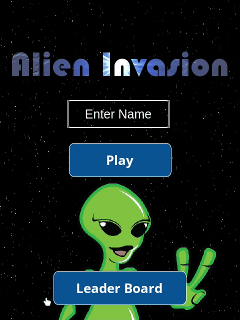

# Space Survival Game

This is a 2D game built with phaser 3. The objective is to stay alive as long as possible and hope to get into the leader boards!
The game increases in difficulty every second that passes.
Objective of the game is to stay alive as long as possible and try and make it to the leader board!

# Game Video Sample

# Live Link

[Live Game](https://condescending-lalande-ec48dd.netlify.app/)

## Game Design Process

I was given five days as the deadline for this game, Here's what those days looked like.

1. I dedicated the first day to reading phaser 3 documentation.
2. Day two - planning out the game objectives, entities, and scenes.
3. Day three - I begin writing the code for the game.
4. Day four - Finishing touches !
5. Day five - Writing Tests for the game.

The 5 days i was given wasn't a suitable enough time to get all the objectives i had planned for the game.
I missed the opportunity to add lives to the ship and also add animations to some of the enemies.

I was however able to get the main objective and functionality of the game finished.

- Game Audios and animations.
- Game difficulty increased by levels.
- Player movement and interaction
- Player Score
- Leader Board using external API to store data.

## Features & Usage

- Player input field for entering their name
- Leader board to display the top 10 players.
- The difficulty increase every second of survival.

## Potential Features

- add health bar to the player ship
- add more animations

## Setup

1. Clone this repository and access the project's directory.
2. Run "npm install".
3. Run "npm run start" to get the server opened automatically.

## Built with

- JavaScript/ES6
- NPM + Webpack
- Phaser 3
- Axios

## Author

👤 **Dannison Arias**

- Github: [@dannisonarias](https://github.com/dannisonarias)
- Twitter: [@AriasDannison](https://twitter.com/AriasDannison)
- Linkedin: [Dannison Arias](https://www.linkedin.com/in/dannison-arias-777919190/)

## 🤝 Contributing

Contributions, issues and feature requests are welcome!

## Show your support

Give a ⭐️ if you like this project!

## 📝 License

This project is [MIT](./license.md) licensed.
